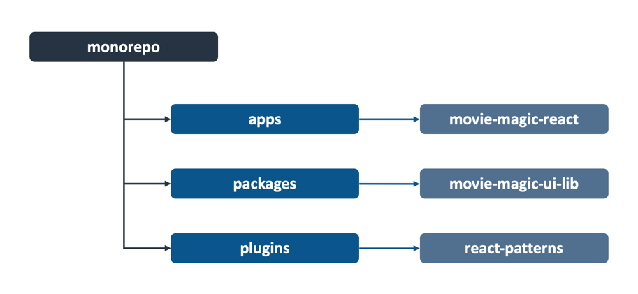

# Monorepo Structure

## Background

Code Shaper plugins are built with the assumption that its generators will be
used in a monorepo. It is possible to use Code Shaper in a polyrepo (a repo that
stores only one project), however we recommend using a monorepo – even if you
house only a single project in it. Monorepos give you a good structure to house
things like plugins, generators, and testing frameworks while keeping the option
to add more projects if needed.

Having said that, your monorepo doesn't have to be enterprise-wide, with
hundreds of projects in it. A small group of related projects should be fine.

This document describes the recommended structure for a monorepo. Please feel
free to fine tune it based on your needs - all the plugins should work just
fine.

:::tip Monorepo Choices

Code Shaper uses [Turborepo](https://turborepo.org/) as its monorepo. However,
any monorepo with the concept of _workspaces_ should work as well. Examples of
such monorepos are
[npm Workspaces](https://docs.npmjs.com/cli/v8/using-npm/workspaces) and
[yarn Workspaces](https://classic.yarnpkg.com/lang/en/docs/workspaces/). In
fact, Turborepo builds on top of these and provides additional capabilities.
Code Shaper plugins simply look for the `workspaces` property in the root
package.json to understand the structure of your monorepo.

:::

## Recommended Structure

We recommend the following workspace structure for your monorepo. The diagram
includes some examples for each workspace type.



This equates to the following `workspaces` definition in package.json:

```json
{
  "workspaces": ["apps/*", "packages/*", "plugins/*"]
}
```

The workspaces are intended to be used as follows:

1. **apps**: contains full-fledged applications that can be deployed on their
   own. Examples are web apps, API servers (REST and GraphQL), microservices,
   etc.
2. **packages**: contains reusable libraries that apps depend on.
3. **plugins**: contains custom plugins created by the project team. These
   generally satisfy project specific standards and patterns. However, plugins
   that are reusable across projects can also be housed here and published to
   npm (or elsewhere) for easier consumption and adoption. Please see
   [Code Shaper Plugin Directory](../community/code-shaper-plugin-directory) for
   a list of publicly available plugins.
