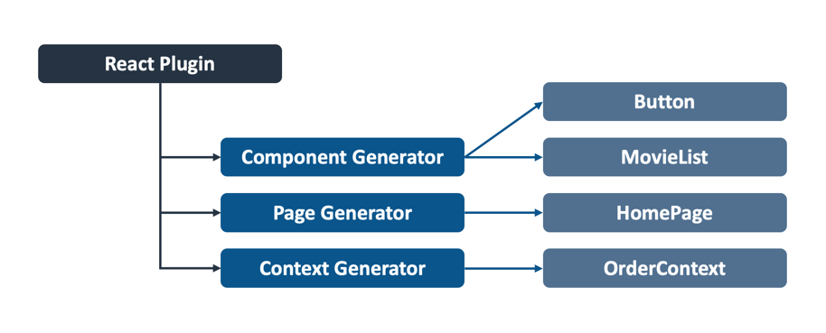

# Plugin Architecture

Code Shaper is designed to be modular and extensible using the concept of
plugins. The `shaper` CLI can load plugins dynamically, thus extending its
functionality to your unique needs. This topic describes the plugin architecture
and implementation mechanics to help you write your own plugins.

## Concepts

- A _plugin_ consists of one or more generators.
- A _generator_ (a.k.a. _item generator_) generates items based on user input.


Here's an example of a plugin that generates React code. It consists of three
generators: Component, Page and Context.

- The _Component Generator_ generates components, e.g. `Button` and `MovieList`.
- The _Page Generator_ generates pages, e.g. `HomePage`.
- The _Context Generator_ generates React contexts, e.g. `OrderContext`.



## Technical Design

### Options

The concept of _Options_ is used throughout Code Shaper. `Options` is a hash of
key-value pairs, where keys are strings and values can be anything (usually
strings, arrays or objects). For example, here's an Options object:

```json
{
  "itemName": "Button",
  "workspace": "packages/ui-lib",
  "dirInWorkspace": "src/components/Button"
}
```

Here's the TypeScript definition of `Options`:

```ts
type Options = { [option: string]: unknown };
```

Options can be specified on the `shaper` command line where they are parsed and
passed onto the selected plugin. The plugin can add to the options by asking
questions to the user. The plugin then sends the combined options to the
selected generator which can ask further questions and add more options.
Finally, the generator uses these options to make text substitutions in
templates before copying them to their destination.

Code Shaper uses the [Inquirer](https://github.com/SBoudrias/Inquirer.js)
library for asking questions to the user and collecting responses. Inquirer
itself has a rich plugin ecosystem that is available for use in your Code Shaper
plugins.

### Plugins

A plugin must conform to the following interface:

```ts
interface Plugin {
  /**
   * Unique identifier of the plugin
   * By convention we use the package name
   * Example: "@code-shaper/react"
   */
  id: string;

  /**
   * Human-readable name
   * Example: "React"
   */
  name: string;

  /**
   * Short description
   * Keep it under 80 characters
   * Example: "generates React applications"
   */
  description: string;

  /**
   * Runs the plugin
   * @param options specific to the plugin - if a required option is not
   * specified, the plugin should prompt for it.
   */
  run: (options: Options) => Promise<void>;
}
```

The `shaper` CLI loads the selected plugin and calls its `run` method, passing
in all the options.

In order to load a plugin, it should be installed as a dev dependency at the
root of your repository. `shaper` reads the dev dependencies to detect which
plugins are available for the user to use.

### Generators

A generator must conform to the following interface:

```ts
interface Generator {
  /**
   * Identifier of the generator
   * Must be unique within a plugin
   * Example: "app"
   */
  id: string;

  /**
   * Human-readable name
   * Example: "Application"
   */
  name: string;

  /**
   * Short description
   * Keep it under 80 characters
   * Example: "generates a React application"
   */
  description: string;

  /**
   * Runs the generator
   * @param options specific to the generator - if a required option is not
   * specified, the generator should prompt for it.
   */
  generate: (options: Options) => Promise<void>;
}
```

The plugin calls the `run` method of the selected generator, passing in all the
options.

## Writing your own plugin

Code Shaper provides a plugin to scaffold your own plugins and generators. You
can learn how to use this plugin under
[Creating a Custom Generator](../how-to-guides/creating-a-custom-generator.md).
