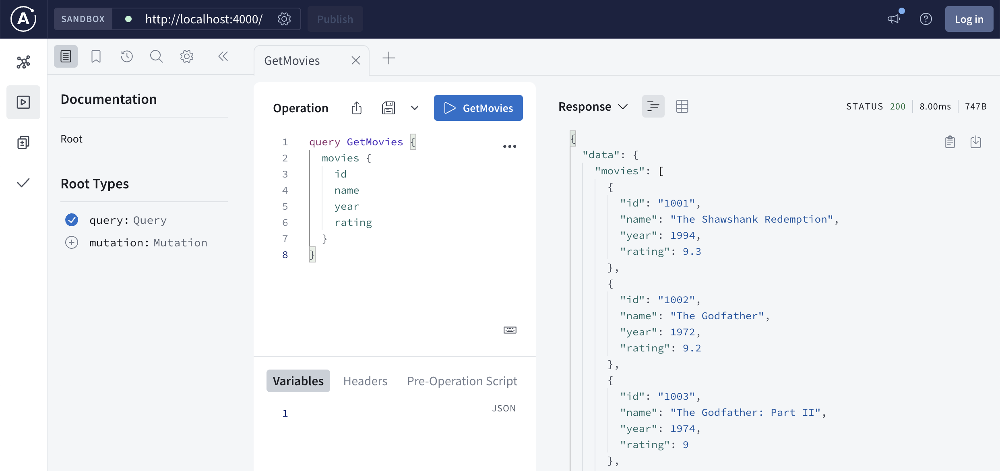
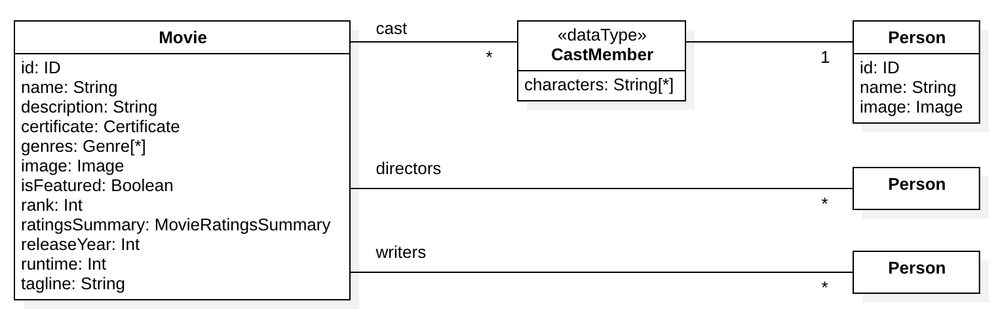
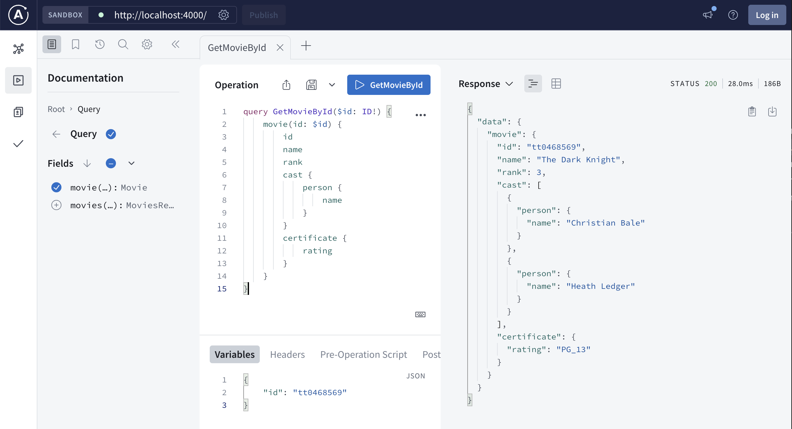

# Create a GraphQL API

The GraphQL Server plugin generates a starter GraphQL API using Apollo Server.
You can then modify this API to meet your requirements. The plugin uses the
following key technologies:

1. Framework: [Apollo Server](https://www.apollographql.com/docs/apollo-server/)
2. GraphQL code generation:
   [graphql-codegen](https://the-guild.dev/graphql/codegen)
3. Linting:
   [Code Shaper ESLint configuration](https://github.com/code-shaper/code-shaper/tree/main/configs/eslint-config)
   & [graphql-eslint](https://the-guild.dev/graphql/eslint/docs)

You can add additional libraries and frameworks depending on your needs.

This section provides basic instructions for generating the starter GraphQL API.
We'll then customize the API to return top 10 movies as required by the Movie
Magic application discussed in other sections. You can find the completed
example
[here](https://github.com/code-shaper/movie-magic/tree/main/apps/movie-magic-graphql-api).

## Prerequisite

Make sure that you have the `movie-magic` repository set up as described in
[Create a new repo](./create-a-new-repo).

## Install GraphQL Server plugin and generate a starter API

Install Code Shaper plugin for GraphQL Server.

```shell
npm install @code-shaper/graphql-server
```

Now generate a GraphQL Server. By convention, servers are created in the
**apps** directory. Let's create one there.

```shell
npx shaper
? Which plugin would you like to run? GraphQL Server
? Which generator would you like to run? apollo-server
? Application name? movie-magic-graphql-api
? Parent directory? apps
? Package name used for publishing? @movie-magic/movie-magic-graphql-api
```

Execute the following commands build and run the server:

```shell
# Install dependencies:
npm install

# Build and run the server
npm run build
npm run dev
```

Point your browser to `http://localhost:4000/`. You should see the Apollo
Sandbox. Paste the following query in the **Operation** section of the sandbox
and click the **GetMovies** button.

```graphql
query GetMovies {
  movies {
    id
    name
    year
    rating
  }
}
```

You should see a list of 10 movies in the **Response** section.



This verifies that the starter GraphQL API is working correctly. Now commit this
version.

```shell
git add .
git commit -m "chore: add movie-magic-graphql-api"
```

The GraphQL API is now ready to be customized to your needs.

## Enhance the GraphQL schema

The starter API returns all 10 movies contained in `movies.json` (at
_apps/movie-magic-graphql-api/src/datasources/movies.json_). We want to enhance
the API to filter, sort and paginate the movies. Let's build this functionality
step-by-step.

We'll start by updating the GraphQL schema to support a richer Movie model. This
will enable us to work with more realistic data to test filtering, sorting and
pagination. Here's the domain model for the enhanced Movie entity. Note that we
have introduced cast members, directors and writers as a new Person entity.



To implement this Movie model, overwrite the `schema.graphql` file in your
`apps/movie-magic-graphql-api/src/gql` folder from the `schema.graphql` file in
[the completed example](https://github.com/code-shaper/movie-magic/blob/main/apps/movie-magic-graphql-api/src/gql/schema.graphql).

:::tip Copying files from the completed example

When copying files from the completed example, do take a minute to understand
them. They are well commented, so it should be easy to understand what they are
doing.

:::

Run a build to generate code from the enhanced schema.

```shell
npm run build
```

This will generate new resolver types in
`apps/movie-magic-graphql-api/src/generated/resolvers-types.ts`. Also note that
the build fails at this point because the existing code is not compatible with
the new resolver types. We will fix this in the following sections.

## Enhance the data sources

Copy the following 4 files from
[the completed example](https://github.com/code-shaper/movie-magic/blob/main/apps/movie-magic-graphql-api/src/datasources)
into the folder `apps/movie-magic-graphql-api/src/datasources` (you will be
overwriting 2 files):

1. `movies.json`: enhanced movie data (note that this data contains references
   to cast members, directors and writers which are persisted in the
   `people.json` file)
2. `MoviesApi.ts`: API to fetch movie data from the `movies.json` file (you can
   think of this as a back-end service that fetches data from a movies database)
3. `people.json`: people data for cast members, directors and writers
4. `PeopleApi.ts`: API to fetch people data from the `people.json` file

:::tip Data Source Concepts

You can read more about data sources
[here](https://www.apollographql.com/docs/apollo-server/data/fetching-data/).

:::

We also need to add `PeopleApi` to the `DataSourceContext`, so that an instance
of this API can be passed to the resolvers. Update
`apps/movie-magic-graphql-api/src/types/DataSourceContext.ts` as follows:

```diff
  import type { MoviesApi } from '@/datasources/MoviesApi';
+ import type { PeopleApi } from '@/datasources/PeopleApi';

  // This interface is used with graphql-codegen to generate types for resolvers context
  export interface DataSourceContext {
    dataSources: {
      moviesApi: MoviesApi;
+     peopleApi: PeopleApi;
    };
  }
```

Finally, we need to create an instance of `PeopleApi` and add it to the context.
Update `apps/movie-magic-graphql-api/src/index.ts` as follows:

```diff
   import { MoviesApi } from './datasources/MoviesApi';
+  import { PeopleApi } from './datasources/PeopleApi';
   ...
       context: async () => ({
         dataSources: {
           moviesApi: new MoviesApi(),
+          peopleApi: new PeopleApi(),
         },
       }),
   ...
```

## Update resolvers

Now that we have the backend set up, let's enhance the resolvers to use it.

Overwrite the following 2 files from
[the completed example](https://github.com/code-shaper/movie-magic/blob/main/apps/movie-magic-graphql-api/src/resolvers)
into the folder `apps/movie-magic-graphql-api/src/resolvers`:

1. `Query.ts`: resolvers for the movie queries
2. `Mutation.ts`: resolver for the new movie mutation `setFeaturedMovie`

:::tip Resolver Concepts

You can read more about resolvers
[here](https://www.apollographql.com/docs/apollo-server/data/resolvers).

:::

## Verify the new API

Execute the following commands build and run the server:

```shell
npm run build
npm run dev
```

Point your browser to `http://localhost:4000/`.

### Get Movie by ID

Paste the following query in the **Operation** section of the sandbox:

```graphql
query GetMovieById($id: ID!) {
  movie(id: $id) {
    id
    name
    rank
    cast {
      person {
        name
      }
    }
    certificate {
      rating
    }
  }
}
```

Paste the following JSON in the **Variables** section of the sandbox:

```json
{
  "id": "tt0468569"
}
```

Click the **GetMovieById** button. You should see the movie named "The Dark
Knight" in the **Response** section.



### Get movies by certificates

Paste the following query in the **Operation** section of the sandbox:

```graphql
query GetMoviesByCerts($input: MoviesRequest!) {
  movies(input: $input) {
    movies {
      name
      certificate {
        rating
      }
    }
    pageInfo {
      totalPages
      totalItems
      page
      perPage
      hasNextPage
      hasPreviousPage
    }
  }
}
```

Paste the following JSON in the **Variables** section of the sandbox to get
movies with PG or R certifications only:

```json
{
  "input": {
    "filterSpec": {
      "certs": ["PG", "R"]
    }
  }
}
```

Click the **GetMoviesByCerts** button. You should see 8 movies in the
**Response** section, 7 certified as "R" and 1 certified as "PG".

### Get top 10 movies

Paste the following query in the **Operation** section of the sandbox:

```graphql
query GetTop10Movies($input: MoviesRequest!) {
  movies(input: $input) {
    movies {
      name
      rank
    }
    pageInfo {
      totalPages
      totalItems
      page
      perPage
      hasNextPage
      hasPreviousPage
    }
  }
}
```

Paste the following JSON in the **Variables** section of the sandbox to sort
movies by rank and return the first 10:

```json
{
  "input": {
    "sortSpec": "RANK_ASC",
    "pageSpec": {
      "page": 1,
      "perPage": 10
    }
  }
}
```

Click the **GetTop10Movies** button. You should see 10 movies in the
**Response** section, ranked 1 to 10.

### Set featured movie

Paste the following mutation in the **Operation** section of the sandbox:

```graphql
mutation SetFeaturedMovie($input: SetFeaturedMovieRequest!) {
  setFeaturedMovie(input: $input) {
    recordId
    record {
      name
      isFeatured
    }
    errors {
      ... on NotFoundError {
        message
      }
    }
  }
}
```

Paste the following JSON in the **Variables** section of the sandbox to set
movie `tt0468569` as featured:

```json
{
  "input": {
    "movieId": "tt0468569",
    "isFeatured": true
  }
}
```

Click the **SetFeaturedMovie** button. You should see the movie in the
**Response** section, with `isFeatured` set to true.

## Commit your code

```shell
# Commit
git add .
git commit -m "feat: customize movies API with filters, sort and pagination"
```

Congratulations! You have successfully built a custom movies API using GraphQL
in just a few minutes. This is the power of Code Shaper.
