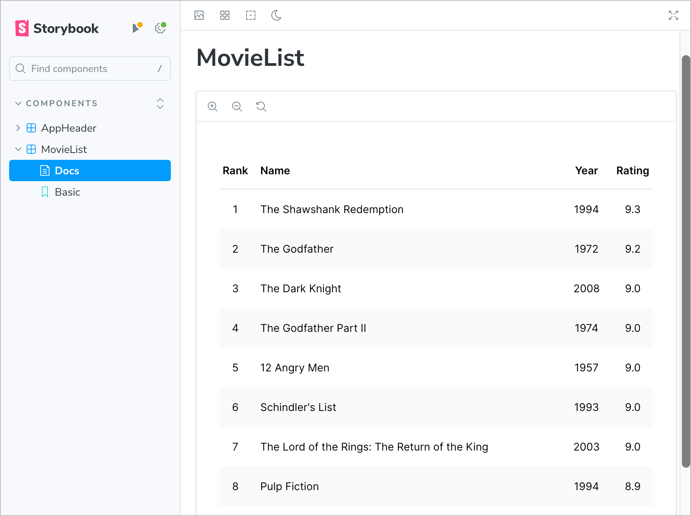

# Create a Next.js App

The Next.js plugin generates an opinionated web application using the following
key technologies:

1. Framework: [React 18](https://react.dev/) + [Next.js](https://nextjs.org/)
2. Styling: Plain CSS or [Tailwind CSS](https://tailwindcss.com/)
3. Linting:
   [Code Shaper ESLint configuration](https://github.robot.car/cruise/cruise-ui/tree/master/configs/eslint-config)
4. Component development: [Storybook](https://storybook.js.org/)
5. Unit testing: [Jest](https://jestjs.io/) +
   [React Testing Library](https://testing-library.com/)
6. API Mocking: [Mock Service Worker](https://mswjs.io/)

You can add additional libraries and frameworks depending on your needs.

This section provides basic instructions for generating a web application using
the Next.js plugin. We'll then show you how to extend this application using
additional generators and popular libraries. The final application will show a
list of top 10 movies as shown below. You can find the completed example of this
application
[here](https://github.com/code-shaper/movie-magic/tree/main/apps/movie-magic-nextjs).


## Prerequisite

Make sure that you have the `movie-magic` repository set up as described in
[Create a new repo](./create-a-new-repo).

## Install Next.js plugin and generate an app

Install Code Shaper plugin for Next.js.

```shell
npm install @code-shaper/nextjs
```

Now generate a Next.js application. By convention, applications are created in
the **apps** directory. Let's create one there.

```shell
npx shaper
? Which plugin would you like to run? Next.js
? Which generator would you like to run? app
? Application name? movie-magic-nextjs
? Parent directory? apps
? Package name used for publishing? @movie-magic/movie-magic-nextjs
? Would you like to use Tailwind CSS? Yes
```

Now execute the following commands for further setup and commit of all changes:

```shell
# Create a local environment file for movie-magic
cp apps/movie-magic-nextjs/.env.example apps/movie-magic-nextjs/.env.local

# Install dependencies:
npm install

# Build and run the app to make sure it works
npm run build
npm run dev

# Point your browser to http://localhost:3000/.
# You should see the running app.

# Run Storybook to make sure it works
npm run storybook

# Point your browser to http://localhost:6006/.
# You should see the running Storybook.

# Commit
git add .
git commit -m "chore: add movie-magic-nextjs app"
```

The app is now ready to customize to your needs.

## Extend the application

Let's see how we can extend our application to show a list of top 10 movies
using additional generators and some popular libraries. Run the following
command in the root directory of your repo to install the libraries we will use
for this example.

> Note: Do not run `npm install` or `npm ci` in any of the subdirectories. It
> will break the build. There should be only one `package-lock.json` file in the
> entire repo (at the root). See
> [Turborepo docs](https://turbo.build/repo/docs/handbook/package-installation#addingremovingupgrading-packages)
> regarding this.

```
npm install clsx axios @tanstack/react-query --workspace @movie-magic/movie-magic-nextjs
```

Here's a short explanation of the libraries we installed:

1. [clsx](https://github.com/lukeed/clsx): A tiny (239B) utility for
   constructing `className` strings conditionally
2. [axios](https://axios-http.com/): A promise-based HTTP Client for node.js and
   the browser
3. [@tanstack/react-query](https://tanstack.com/query): Asynchronous state
   management for React, providing declarative, auto-managed queries and
   mutations

## Create TypeScript definitions

Let's start by creating TypeScript definitions for data structures that we will
need in our app. Copy the following 4 files from
[the completed example](https://github.com/code-shaper/movie-magic/blob/main/apps/movie-magic-nextjs/src/models)
into your `apps/movie-magic-nextjs/src/models` folder:

1. `index.ts`
2. `Movie.ts`
3. `PaginationInfo.ts`
4. `QueryParams.ts`

:::tip Copying files from the completed example

When copying files from the completed example, do take a minute to understand
them. They are well commented, so it should be easy to understand what they are
doing.

:::

## Create a MovieList component

Now we will create a `MovieList` component that receives a list of movies and
displays it. Such components are called _presentational_ components - they don't
worry about how the data was obtained, their job is to simply render it.

We will generate the `<MovieList>` component using the component generator
provided by the Next.js plugin. Follow the steps below:

```shell
npx shaper
? Which plugin would you like to run? Next.js
? Which generator would you like to run? component
? Component name? MovieList
? Which workspace should this go to? apps/movie-magic-nextjs
? Parent directory within workspace? src/components/MovieList
```

A placeholder MovieList component has been created for you. Also a placeholder
Storybook story has been created. Let's implement MovieList interactively using
Storybook.

```shell
npm run storybook
```

Point your browser to `http://localhost:6006`. Storybook shows the placeholder
implementation of `MovieList`.

## Implement the MovieList component

We are now ready to implement the real `MovieList`.

1. Create the data to render movies. Copy the `movies.ts` file from
   [the completed example](https://github.com/code-shaper/movie-magic/blob/main/apps/movie-magic-nextjs/src/mocks/movies.ts)
   into your `apps/movie-magic-nextjs/src/mocks` folder.
2. Overwrite the placeholder implementation of `MovieList` at
   `apps/movie-magic-nextjs/src/components/MovieList/MovieList.tsx` from
   [the completed example](https://github.com/code-shaper/movie-magic/blob/main/apps/movie-magic-nextjs/src/components/MovieList/MovieList.tsx).
3. Overwrite the placeholder story for `MovieList` at
   `apps/movie-magic-nextjs/src/components/MovieList/MovieList.stories.tsx` from
   [the completed example](https://github.com/code-shaper/movie-magic/blob/main/apps/movie-magic-nextjs/src/components/MovieList/MovieList.stories.tsx).

Here's a snapshot of the final Storybook story.

:::tip You may need to restart Storybook

You may need to restart Storybook in case TailwindCSS did not recompile the CSS
automatically.

:::



## Test the MovieList component

It's good to write unit tests for our components to ensure that:

1. they are working correctly,
2. they keep working correctly when any code in your repo changes.

Let's write a unit test for the `MovieList` component. This one ensures that it
renders the correct number of movies. You can find more best practices for unit
testing in
[React Testing Techniques](https://github.com/nareshbhatia/react-testing-techniques).

Overwrite the placeholder test for `MovieList` at
`apps/movie-magic-nextjs/src/components/MovieList/MovieList.test.tsx` from
[the completed example](https://github.com/code-shaper/movie-magic/blob/main/apps/movie-magic-nextjs/src/components/MovieList/MovieList.test.tsx).

Run the tests from the root directory. All tests should pass.

```shell
npm test
```

MovieList is now fully implemented, let's commit the code:

```shell
# Commit
git add .
git commit -m "feat: add MovieList"
```

## Mock API request

Now that we have implemented the `MovieList` component, we need to fetch a list
of movies from some server and feed it to `MovieList`. However, before fetching
from a real server, we will fetch it from a mock server. This will allow us to
test our app independent of a real server. To do this, we will use a tool called
[Mock Service Worker](https://mswjs.io/) (MSW). MSW intercepts API requests at
the network level and returns mock responses.

Replace the placeholder content in
`apps/movie-magic-nextjs/src/mocks/handlers.ts` from
[the completed example](https://github.com/code-shaper/movie-magic/blob/main/apps/movie-magic-nextjs/src/mocks/handlers.ts).

Now create a file called `api.ts` under `apps/movie-magic-nextjs/src/utils` (you
will have to create the `utils` directory). Add the following content to this
file. It sets up an [axios instance](https://axios-http.com/docs/instance) that
we will use to fetch data from the real or mock server.

```ts title="apps/movie-magic-nextjs/src/utils/api.ts"
import axios from 'axios';

// Create an axios instance
export const api = axios.create();
```

## Setup Tanstack React Query

In addition to Axios, we'll setup
[Tanstack React Query](https://tanstack.com/query) to make REST calls. This is
done by creating a `QueryProvider` and adding it near the root of our component
tree.

Copy the `QueryProvider.tsx` file from
[the completed example](https://github.com/code-shaper/movie-magic/blob/main/apps/movie-magic-nextjs/src/providers/QueryProvider.tsx)
into your `apps/movie-magic-nextjs/src/providers` folder.

Now add `QueryProvider` near the root of our component tree. To do this edit
`AppProvider.tsx` under `apps/movie-magic-nextjs/src/providers` as shown below:

```diff title="apps/movie-magic-nextjs/src/providers/AppProvider.tsx"
'use client';

+ import { QueryProvider } from './QueryProvider';
import { useMockServiceWorker } from './useMockServiceWorker';

...

-  return <>{children}</>;
+  return <QueryProvider baseApiUrl={baseApiUrl}>{children}</QueryProvider>;
}
```

## Update HomePage to fetch movies

We now have all the REST infrastructure set. Let's use it to fetch data from the
mock server and show it on the home page. Replace the entire content of
`apps/movie-magic-nextjs/src/app/page.tsx` from
[the completed example](https://github.com/code-shaper/movie-magic/blob/main/apps/movie-magic-nextjs/src/app/page.tsx).

Now run the following command in the root directory of your repo. You should see
the app running in your browser (http://localhost:3000/) showing the list of top
10 movies.

```shell
npm run dev
```

## Commit your code

```shell
# Commit
git add .
git commit -m "feat: add MovieList to the home page"
```

Congratulations! You have successfully built a Next.js web application from
scratch in just a few minutes. This is the power of Code Shaper.
