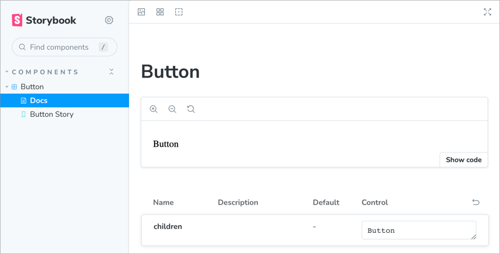
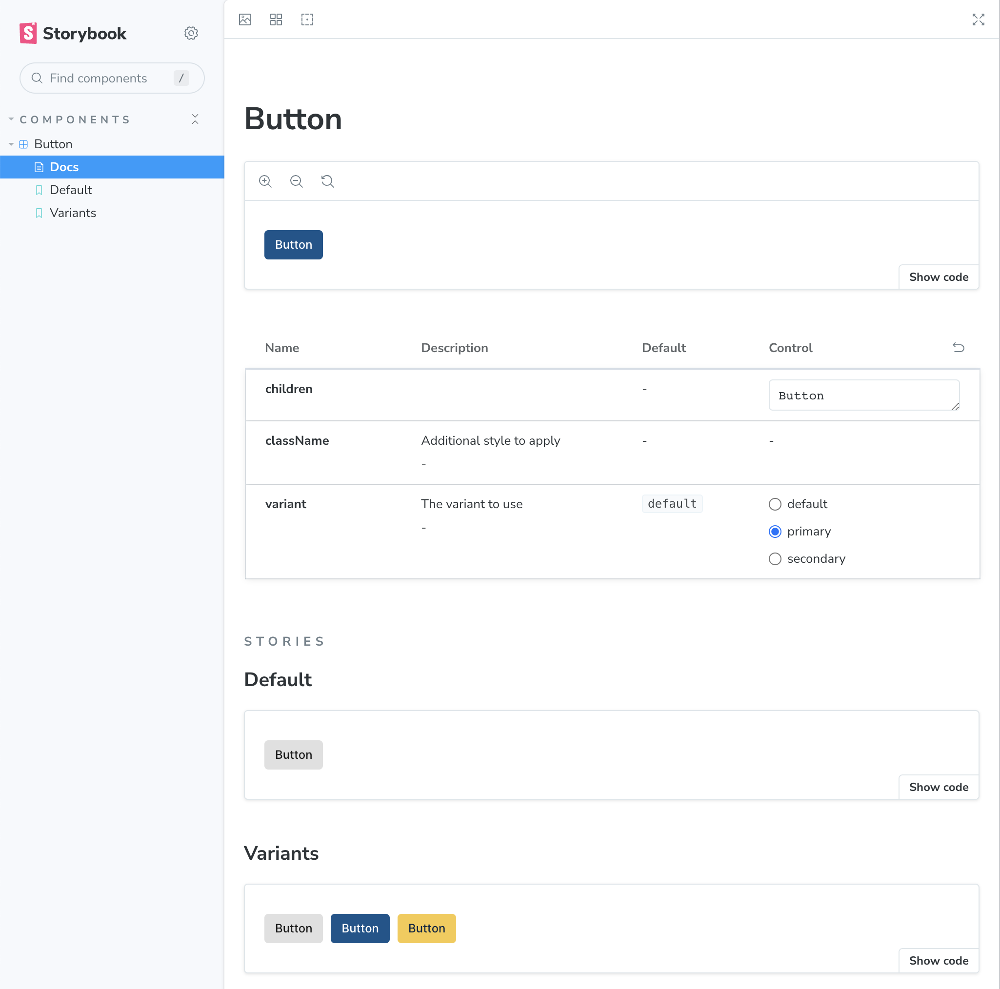

# Creating a component library

By convention, libraries are created in the **packages** directory. Let's create
one there.

## Create a React library

```bash
shaper
? Which plugin would you like to run? React
? Which generator would you like to run? react-library
? Library name? ui-lib
? Parent directory? ./packages
? Package name used for publishing? @movie-magic/ui-lib

# In the root directory, edit package.json to force the latest version
# of React. This is done by adding the following overrides section after
# the devDependencies section:
"overrides": {
  "react": "^18.1.0",
  "react-dom": "^18.1.0"
},

# Edit /configs/typescript-config-custom/package.json to add a new
# typescript configuration (react-library.json). See below:
"files": [
  "base.json",
  "react-library.json"
],

# In the root directory, run:
npm run clean
npm install

# Commit
git add .
git commit -m "added ui-lib"
```

## Add a component

Now let's add a button component to `ui-lib`.

```bash
shaper
? Which plugin would you like to run? React
? Which generator would you like to run? component
? Component name? Button
? Which workspace should this go to? packages/ui-lib

# A placeholder Button component has been created for you.
# Now let's implement it interactively using Storybook.
npm run storybook
```

Point your browser to http://localhost:6006. Storybook shows a placeholder
implementation of the button. However, it does not look like a button at all.
It's simply a `<div>` with some text.



Before implementing the button, let's add some css styles provided by the React
plugin to Storybook. Edit `storybook/.storybook/preview.tsx` and add the
following css import to it:

```tsx
// highlight-next-line
import '../../packages/ui-lib/src/styles/main.css';

export const parameters = {
  ...
};
```

Then add the following code to `storybook/.storybook/preview-head.html` to
download the `Inter` font required by the CSS.

```html
<!--
  Use this file to add any extra elements to the head of your
  Storybook preview iframe.
-->

<link rel="preconnect" href="https://fonts.googleapis.com" />
<link rel="preconnect" href="https://fonts.gstatic.com" crossorigin />
<link
  rel="stylesheet"
  href="https://fonts.googleapis.com/css2?family=Inter:wght@300;400;500;600&display=swap"
/>
```

You should immediately see the change in Storybook.

Finally, overwrite the code in
`packages/ui-lib/src/components/Button/Button.tsx` with the required
implementation of the button. Note that the button has a color property with 3
possible values: `'default' | 'primary' | 'secondary'`.

```tsx
import * as React from 'react';

interface ButtonProps {
  rootClass?: string;
  color?: 'default' | 'primary' | 'secondary';
  children?: React.ReactNode;
  onClick?: React.MouseEventHandler<HTMLButtonElement>;
}

export const Button = ({
  rootClass,
  color = 'default',
  children,
  onClick,
}: ButtonProps) => {
  const classes = [];

  if (rootClass) {
    classes.push(rootClass);
  }

  classes.push('button');

  switch (color) {
    case 'default': {
      classes.push('button--default');
      break;
    }
    case 'primary': {
      classes.push('button--primary');
      break;
    }
    case 'secondary': {
      classes.push('button--secondary');
      break;
    }
  }

  return (
    <button className={classes.join(' ')} onClick={onClick}>
      {children}
    </button>
  );
};
```

## Implement a Storybook story

Modify the placeholder Button story to demonstrate its color variations. Simply
overwrite `packages/ui-lib/src/components/Button/Button.stories.tsx` with the
following code:

```tsx
import { Story, Meta } from '@storybook/react';
import { Button } from './Button';

export default {
  title: 'Components/Button',
  component: Button,
  argTypes: { onClick: { action: 'clicked' } },
} as Meta;

const Template: Story = (args) => {
  return (
    <Button
      rootClass={args.rootClass}
      color={args.color}
      onClick={args.onClick}
    >
      {args.text}
    </Button>
  );
};

export const ButtonStory = Template.bind({});
ButtonStory.storyName = 'Button';
ButtonStory.args = {
  text: 'Button',
  rootClass: '',
  color: 'primary',
};
```

The snapshot below shows the updated Storybook interface. Notice that you can
interactively change button props and see how the button behaves. Once you are
satisfied with the implementation, move on to implement unit tests for the
button.



## Implement unit tests

Unit tests are important to automate the testing of our components. They also
serve as documentation for the component's requirements. Finally, they are
incredibly useful to ensure that future code changes don't break the component.

Modify the placeholder Button test to exercise its requirements. Simply
overwrite `packages/ui-lib/src/components/Button/Button.test.tsx` with the
following code:

```tsx
import { render } from '@testing-library/react';
import { Button } from './Button';

describe('<Button />', () => {
  test('colors render correctly', () => {
    const { asFragment } = render(
      <div>
        <Button color="default">Submit</Button>
        <Button color="primary">Submit</Button>
        <Button color="secondary">Submit</Button>
      </div>
    );
    expect(asFragment()).toMatchSnapshot();
  });

  test('class can be added via rootClass prop', () => {
    const { asFragment } = render(<Button rootClass="ml-2">Submit</Button>);
    expect(asFragment()).toMatchSnapshot();
  });
});
```

Run the tests from the repo's root directory:

```bash
npm test

> movie-magic@0.0.1 test
> turbo run test

• Packages in scope: @movie-magic/ui-lib, eslint-config-custom, jest-config-custom, typescript-config-custom
• Running test in 4 packages
@movie-magic/ui-lib:test: cache miss, executing 7cd43a8f278966ce
@movie-magic/ui-lib:test:
@movie-magic/ui-lib:test: > @movie-magic/ui-lib@0.0.1 test
@movie-magic/ui-lib:test: > jest --coverage
@movie-magic/ui-lib:test:
@movie-magic/ui-lib:test: PASS src/components/Button/Button.test.tsx
@movie-magic/ui-lib:test:  › 2 snapshots written.
@movie-magic/ui-lib:test: -------------------|---------|----------|---------|---------|-------------------
@movie-magic/ui-lib:test: File               | % Stmts | % Branch | % Funcs | % Lines | Uncovered Line #s
@movie-magic/ui-lib:test: -------------------|---------|----------|---------|---------|-------------------
@movie-magic/ui-lib:test: All files          |   90.47 |      100 |     100 |   89.47 |
@movie-magic/ui-lib:test:  components        |       0 |      100 |     100 |       0 |
@movie-magic/ui-lib:test:   index.ts         |       0 |      100 |     100 |       0 | 1
@movie-magic/ui-lib:test:  components/Button |      95 |      100 |     100 |   94.44 |
@movie-magic/ui-lib:test:   Button.tsx       |     100 |      100 |     100 |     100 |
@movie-magic/ui-lib:test:   index.ts         |       0 |      100 |     100 |       0 | 1
@movie-magic/ui-lib:test: -------------------|---------|----------|---------|---------|-------------------
@movie-magic/ui-lib:test:
@movie-magic/ui-lib:test: Snapshot Summary
@movie-magic/ui-lib:test:  › 2 snapshots written from 1 test suite.
@movie-magic/ui-lib:test:
@movie-magic/ui-lib:test: Test Suites: 1 passed, 1 total
@movie-magic/ui-lib:test: Tests:       2 passed, 2 total
@movie-magic/ui-lib:test: Snapshots:   2 written, 2 total
@movie-magic/ui-lib:test: Time:        6.933 s
@movie-magic/ui-lib:test: Ran all test suites.

 Tasks:    1 successful, 1 total
Cached:    0 cached, 1 total
  Time:    12.85s
```

## Commit your code

We are now done with our button implementation. Let's commit the code.

```
# Commit
git add .
git commit -m "added button component"
```

We are now ready to create our first web app using Code Shaper. Navigate to
[Creating an application](./creating-an-application.md).
