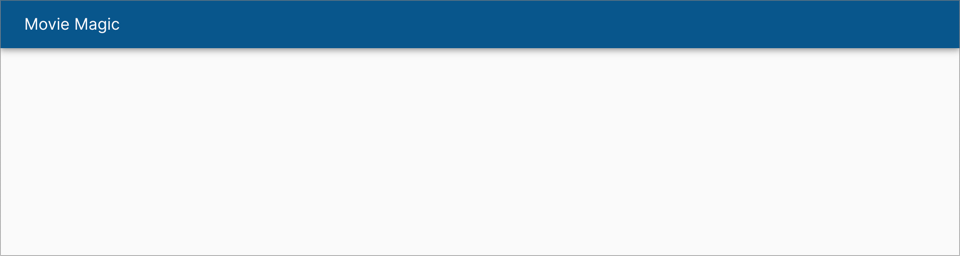
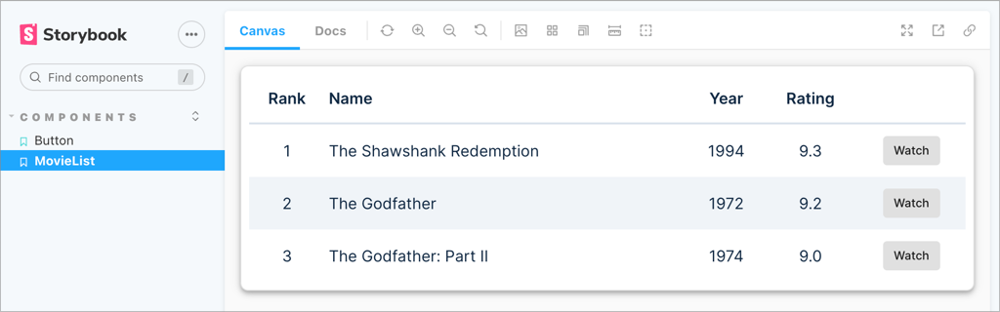
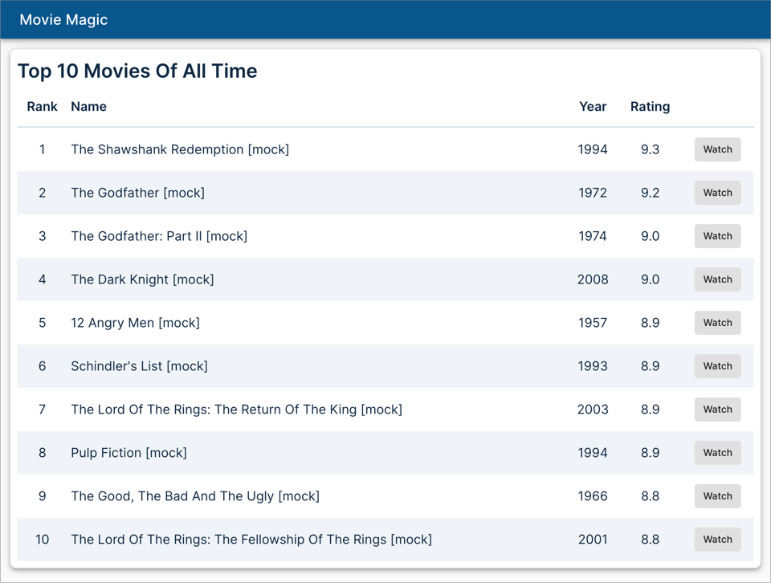

# Creating an application

By convention, applications are created in the **apps** directory. Let's create
one there.

## Create a React app

```shell
npx shaper
? Which plugin would you like to run? React
? Which generator would you like to run? app
? Application name? movie-magic
? Parent directory? apps
? Package name used for publishing? @movie-magic/movie-magic
```

Add a dependency in `apps/movie-magic/package.json` to `ui-lib`:

```json title="apps/movie-magic/package.json"
"dependencies": {
  "@movie-magic/ui-lib": "*",
  ...
}
```

Since we will develop components in this app using Storybook, add it as a
dependency in Storybook.

```json title="apps/movie-magic-storybook/package.json"
  "dependencies": {
    // highlight-next-line
    "@movie-magic/movie-magic": "*",
    "@movie-magic/ui-lib": "*",
    "react": "^18.2.0",
    "react-dom": "^18.2.0"
  },
```

Install dependencies and run the app:

```shell
# In the root directory, run:
npm install

# Run the app from the root directory
npm run dev
```

Point your browser to `http://localhost:3000`. You should see a placeholder home
page with just a header.



The goal of this section is to show a list of top 10 movies on this page.

Before we go forward, let's commit the generated code:

```shell
# Commit
git add .
git commit -m "chore: add movie-magic app"
```

## Create a Movie model

Let's start by creating a TypeScript definition for a movie. Add a file called
`Movie.ts` under `apps/movie-magic/src/models` with the following content.

```ts title="apps/movie-magic/src/models/Movie.ts"
export interface Movie {
  id: string;
  name: string;
  year: number;
  rating: number;
}
```

Add another file called `index.ts` to easily access the movie definition. This
is called _barreling_.

```ts title="apps/movie-magic/src/models/index.ts"
export * from './Movie';
```

## Create a MovieList component

Now we will create a `MovieList` component that receives a list of movies and
displays it. Such components are called _presentational_ components - they don't
worry about how the data was obtained, their job is to simply render it.

The process of generating the `<MovieList>` component is exactly the same as
that for the `<Button>` component from the last section. Follow the steps below:

```shell
npx shaper
? Which plugin would you like to run? React
? Which generator would you like to run? component
? Component name? MovieList
? Which workspace should this go to? apps/movie-magic
? Parent directory within workspace? src/components/MovieList
```

A placeholder MovieList component has been created for you. Also a placeholder
Storybook story has been created. Let's implement MovieList interactively using
Storybook.

```shell
npm run dev
```

Point your browser to `http://localhost:6006`. Storybook shows a placeholder
implementation of MovieList.

## Implement MovieList

We are now ready to implement `MovieList`. Overwrite the placeholder
implementation with the one below.

```tsx title="apps/movie-magic/src/components/MovieList/MovieList.tsx"
import type { Movie } from '@/models';
import { Button } from '@movie-magic/ui-lib';

export interface MovieListProps {
  movies: Movie[];
}

export function MovieList({ movies }: MovieListProps) {
  return (
    <table data-testid="movie-table">
      <thead>
        <tr>
          <th className="text-center">Rank</th>
          <th>Name</th>
          <th className="text-center">Year</th>
          <th className="text-center">Rating</th>
          <td />
        </tr>
      </thead>
      <tbody>
        {movies.map((movie, index) => (
          <tr key={movie.id}>
            <td className="text-center">{index + 1}</td>
            <td>{movie.name}</td>
            <td className="text-center">{movie.year}</td>
            <td className="text-center">{movie.rating.toFixed(1)}</td>
            <td className="text-center">
              <Button>Watch</Button>
            </td>
          </tr>
        ))}
      </tbody>
    </table>
  );
}
```

We also need to modify the story to supply a list of movies. Overwrite the story
with the code below:

```tsx title="apps/movie-magic/src/components/MovieList/MovieList.stories.tsx"
import { MovieList } from './MovieList';
import type { Meta, StoryObj } from '@storybook/react';

const meta = {
  title: 'Components/MovieList',
  component: MovieList,
  tags: ['autodocs'],
  argTypes: {
    movies: {
      description: 'A list of movies',
    },
  },
} satisfies Meta<typeof MovieList>;

export default meta;
type Story = StoryObj<typeof meta>;

export const Basic = {
  args: {
    movies: [
      {
        id: '65667a66-d848-4eba-a2ca-c167c39d8f57',
        name: 'The Shawshank Redemption',
        year: 1994,
        rating: 9.3,
      },
      {
        id: '116dac8b-e75b-4abb-8da3-4f72e2274e50',
        name: 'The Godfather',
        year: 1972,
        rating: 9.2,
      },
      {
        id: '2fd1e450-6622-43b7-977f-2640a48cb032',
        name: 'The Godfather: Part II',
        year: 1974,
        rating: 9.0,
      },
    ],
  },
} satisfies Story;
```

Here's a snapshot of the updated Storybook interface.



## Implement unit tests

The final step is to implement a unit test for `MovieList`. Update the
placeholder test with the code below.

```tsx title="apps/movie-magic/src/components/MovieList/MovieList.test.tsx"
import { MovieList } from './MovieList';
import { render, screen } from '../../test/test-utils';

const movies = [
  {
    id: '65667a66-d848-4eba-a2ca-c167c39d8f57',
    name: 'The Shawshank Redemption',
    year: 1994,
    rating: 9.3,
  },
  {
    id: '116dac8b-e75b-4abb-8da3-4f72e2274e50',
    name: 'The Godfather',
    year: 1972,
    rating: 9.2,
  },
  {
    id: '2fd1e450-6622-43b7-977f-2640a48cb032',
    name: 'The Godfather: Part II',
    year: 1974,
    rating: 9.0,
  },
];

describe('<MovieList />', () => {
  it('should renders correctly', async () => {
    render(<MovieList movies={movies} />);

    // expect 3 movies
    const movieTable = await screen.findByTestId('movie-table');
    const movieRows = movieTable.querySelectorAll('tbody tr');
    expect(movieRows).toHaveLength(movies.length);
  });
});
```

:::danger Workaround for Jest issue

There appears to be an issue with Jest when coverage is turned on. The tests
will pass, but you will see the following error when Jest is collecting coverage
information:

"ERROR: Jest worker encountered 3 child process exceptions, exceeding retry
limit"

To work around this issue we have disabled coverage for the movie-magic app. If
you want to enable it, edit **apps/movie-magic/package.json** and add the
`--coverage` option for jest.

:::

Run the tests from the root directory. All tests should pass.

```shell
npm test
```

MovieList is now fully implemented, let's commit the code:

```shell
# Commit
git add .
git commit -m "feature: add movie-list"
```

## Mock API request

Now that we have implemented the `MovieList` component, we need to think about
how to fetch the list of top 10 movies and feed it to `MovieList. To do this, we
will use a tool called [Mock Service Worker](https://mswjs.io/). MSW intercepts
API requests at the network level and returns mock responses. This allows us to
start testing our front-end without having to wait for the real API to be ready.

Add the following file containing movie data under the `mocks` directory:

```ts title="apps/movie-magic/src/mocks/mockMovies.ts"
import type { Movie } from '../models';

export const mockMovies: Movie[] = [
  {
    id: '65667a66-d848-4eba-a2ca-c167c39d8f57',
    name: 'The Shawshank Redemption',
    year: 1994,
    rating: 9.3,
  },
  {
    id: '116dac8b-e75b-4abb-8da3-4f72e2274e50',
    name: 'The Godfather',
    year: 1972,
    rating: 9.2,
  },
  {
    id: '2fd1e450-6622-43b7-977f-2640a48cb032',
    name: 'The Godfather: Part II',
    year: 1974,
    rating: 9.0,
  },
  {
    id: 'aca55373-155b-49c0-9561-e23a4cb19870',
    name: 'The Dark Knight',
    year: 2008,
    rating: 9.0,
  },
  {
    id: '5a78da59-0799-4ac9-80ad-4ffefbde233b',
    name: '12 Angry Men',
    year: 1957,
    rating: 8.9,
  },
  {
    id: '8c4b74d2-d5fd-4d8e-894b-7e36efef13e7',
    name: "Schindler's List",
    year: 1993,
    rating: 8.9,
  },
  {
    id: '77b01a0f-6778-4287-a5ee-23ce4e3f8157',
    name: 'The Lord Of The Rings: The Return Of The King',
    year: 2003,
    rating: 8.9,
  },
  {
    id: '31ba7b74-7b3f-4fb5-add8-cb6b14c7a454',
    name: 'Pulp Fiction',
    year: 1994,
    rating: 8.9,
  },
  {
    id: '9421df8c-e4b6-43d3-a8e9-b5f3e9faaa3d',
    name: 'The Good, The Bad And The Ugly',
    year: 1966,
    rating: 8.8,
  },
  {
    id: '6f0f8008-a0ea-4bfd-8136-d7b21e3094f8',
    name: 'The Lord Of The Rings: The Fellowship Of The Rings',
    year: 2001,
    rating: 8.8,
  },
];
```

Replace the placeholder handler in `handlers.ts` with `top-10-movies` handler:

```ts title="apps/movie-magic/src/mocks/handlers.ts"
import { MOCK_API_URL } from './constants';
// highlight-next-line
import { mockMovies } from './mockMovies';
import { rest } from 'msw';

export const handlers = [
  // highlight-start
  rest.get(`${MOCK_API_URL}/top-10-movies`, async (req, res, ctx) =>
    res(ctx.status(200), ctx.json(mockMovies))
  ),
  // highlight-end
];
```

This completes the implementation of the mock API handler. We will call this API
from the client using a fetch hook. Before we do that, let's commit our code:

```shell
# Commit
git add .
git commit -m "chore: add mock api for fetching top 10 movies"
```

## Create a hook to fetch movies

Create a file called `useMovies.ts` under the **HomePage** folder to fetch top
10 movies.

```ts title="apps/movie-magic/src/pages/HomePage/useMovies.ts"
import type { Movie } from '@/models';
import * as React from 'react';

/**
 * Hook to fetch movies
 */
export function useMovies() {
  const apiUrl = import.meta.env.VITE_API_URL;
  const failMessage = 'Failed to get movies';

  const [isLoading, setIsLoading] = React.useState(false);
  const [isError, setIsError] = React.useState(false);
  const [error, setError] = React.useState<Error>();
  const [movies, setMovies] = React.useState<Movie[]>([]);

  React.useEffect(() => {
    const fetchMovies = async () => {
      try {
        setIsLoading(true);
        const response = await fetch(`${apiUrl}/top-10-movies`);

        if (!response.ok) {
          setIsError(true);
          setError(new Error(`${failMessage} (${response.status})`));
          setIsLoading(false);
          return;
        }

        // eslint-disable-next-line @typescript-eslint/no-unsafe-assignment
        const movies: Movie[] = await response.json();
        setMovies(movies);
        setIsLoading(false);
      } catch (error) {
        setIsError(true);
        setError(error instanceof Error ? error : new Error(failMessage));
        setIsLoading(false);
      }
    };

    // eslint-disable-next-line @typescript-eslint/no-floating-promises
    fetchMovies();
  }, [apiUrl]);
  return { isLoading, isError, error, movies };
}
```

Add a file `apps/movie-magic-react/src/env.d.ts` to specify the type of
`import.meta.env.VITE_API_URL` which is used above in `useMovies.ts`

```ts title="apps/movie-magic-react/src/env.d.ts"
// eslint-disable-next-line spaced-comment
/// <reference types="vite/client" />

interface ImportMetaEnv {
  readonly VITE_API_URL: string;
}

interface ImportMeta {
  readonly env: ImportMetaEnv;
}
```

## Create a container to fetch movies

Create a file called `MovieListContainer.tsx` under the **HomePage** folder.
This component fetch movies using the `useMovies` hook we created above. Once
the movies are received, it renders them using the `MovieList` component we
created earlier.

```tsx title="apps/movie-magic/src/pages/HomePage/MovieListContainer.tsx"
import { useMovies } from './useMovies';
import { MovieList } from '@/components/MovieList';

export function MovieListContainer() {
  const { isLoading, isError, error, movies } = useMovies();

  if (isLoading) {
    return <div>Loading...</div>;
  }

  if (isError) {
    return <h1 className="mb-2 text-2xl font-semibold">{error?.message}</h1>;
  }

  return (
    <>
      <h1 className="mb-2 text-2xl font-semibold">Top 10 Movies Of All Time</h1>
      <MovieList movies={movies} />
    </>
  );
}
```

## Add container to HomePage

Finally, add `MovieListContainer` to `HomePage` to render the list of movies in
the home page.

```tsx title="apps/movie-magic/src/pages/HomePage/HomePage.tsx"
// highlight-next-line
import { MovieListContainer } from './MovieListContainer';
import { Header } from '@/components/Header';

export function HomePage() {
  return (
    <>
      <Header />
      // highlight-start
      <div className="p-3">
        <div className="card p-3">
          <MovieListContainer />
        </div>
      </div>
      // highlight-end
    </>
  );
}
```

Run the app:

```shell
npm run dev
```

Point your browser to `http://localhost:3000`. You should see the updated home
page with the movie list.



## Commit your code

```shell
# Commit
git add .
git commit -m "feature: add movie list to the home page"
```

Congratulations! You have now learned how to use Code Shaper using off-the-shelf
generators. Now let's learn
[how to write your own custom generator](./writing-a-custom-generator)
