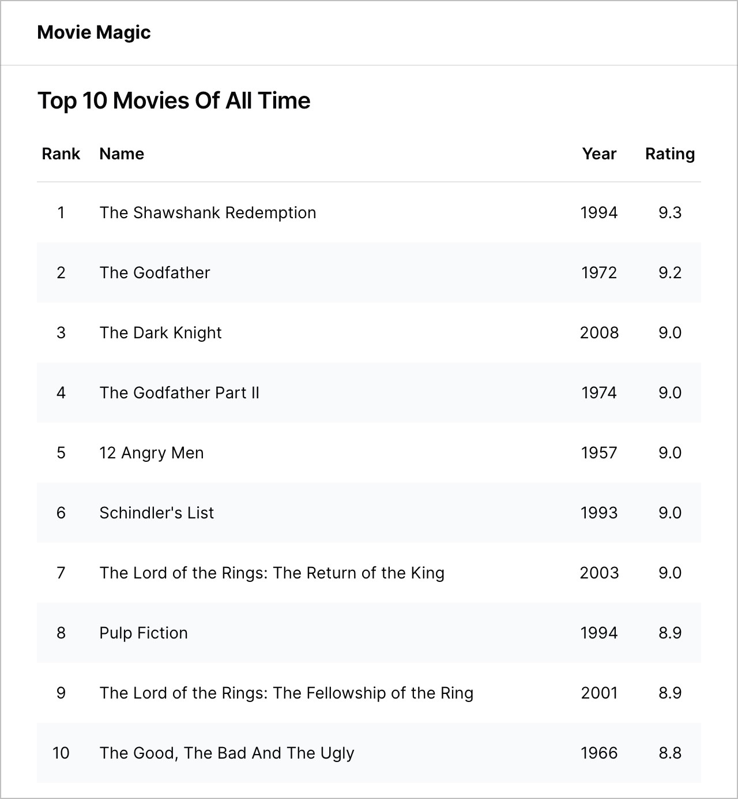

# Creating an application

By convention, applications are created in the **apps** directory. Let's create
one there.

## Create a React app

```shell
shaper
? Which plugin would you like to run? React
? Which generator would you like to run? app
? Application name? movie-magic
? Parent directory? apps
? Package name used for publishing? @movie-magic/movie-magic

# Add a dependency to ui-lib in apps/movie-magic/package.json
"dependencies": {
  "@movie-magic/ui-lib": "*",
  ...
}

# In the root directory, run:
npm install

# To make sure that everything is set up correctly, run a build
npm run build

# Finally, run the app from the root directory
npm run dev
```

Point your browser to `http://localhost:3000`. You should see a placeholder home
page with just a header.


The goal of this section is to show a list of top 10 movies on this page. We
will start by creating a `MovieList` component that receives a list of movies
and displays it. Such components are called _presentational_ components - they
don't worry about how the data was obtained, their job is to simply render the
data.

## Create a MovieList component

We created a `<Button>` component in the last section. The process to create the
`<MovieList>` component is exactly the same. Follow the steps below:

```shell
shaper
? Which plugin would you like to run? React
? Which generator would you like to run? component
? Component name? MovieList
? Which workspace should this go to? apps/movie-magic

# A placeholder MovieList component has been created for you.
# Now let's implement it interactively using Storybook.
npm run storybook

# Point your browser to http://localhost:6006.
# Storybook shows a placeholder implementation of MovieList.
```

## Create a Movie model

Before implementing `MovieList`, let's create the TypeScript definition for a
movie. Add a file called `Movie.ts` under `apps/movie-magic/src/models` with the
following content.

```ts title="apps/movie-magic/src/models/Movie.ts"
export interface Movie {
  name: string;
  year: number;
  rating: number;
}
```

Add another file called `index.ts` to easily access the movie definition. This
is called _barreling_.

```ts title="apps/movie-magic/src/models/index.ts"
export * from './Movie';
```

## Implement MovieList

We are now ready to implement `MovieList`. Overwrite the placeholder
implementation with the one below.

```tsx title="apps/movie-magic/src/components/MovieList/MovieList.tsx"
import * as React from 'react';
import { Button } from '@movie-magic/ui-lib';
import { Movie } from '../../models';

interface MovieListProps {
  movies: Array<Movie>;
}

export function MovieList({ movies }: MovieListProps) {
  return (
    <table data-testid="movie-table">
      <thead>
        <tr>
          <th className="text-center">Rank</th>
          <th>Name</th>
          <th className="text-center">Year</th>
          <th className="text-center">Rating</th>
          <td></td>
        </tr>
      </thead>
      <tbody>
        {movies.map((movie, index) => (
          <tr key={movie.name}>
            <td className="text-center">{index + 1}</td>
            <td>{movie.name}</td>
            <td className="text-center">{movie.year}</td>
            <td className="text-center">{movie.rating.toFixed(1)}</td>
            <td className="text-center">
              <Button>Watch</Button>
            </td>
          </tr>
        ))}
      </tbody>
    </table>
  );
}
```

We also need to modify the story to supply a list of movies. Overwrite the story
with the code below:

```tsx title="apps/movie-magic/src/components/MovieList/MovieList.stories.tsx"
import { Story, Meta } from '@storybook/react';
import { MovieList } from './MovieList';

export default {
  title: 'Components/MovieList',
  component: MovieList,
} as Meta;

const Template: Story = (args) => (
  <div className="card p-2">
    <MovieList movies={args.movies} />
  </div>
);

export const MovieListStory = Template.bind({});
MovieListStory.storyName = 'MovieList';
MovieListStory.args = {
  movies: [
    {
      name: 'The Shawshank Redemption',
      year: 1994,
      rating: 9.3,
    },
    {
      name: 'The Godfather',
      year: 1972,
      rating: 9.2,
    },
    {
      name: 'The Godfather: Part II',
      year: 1974,
      rating: 9.0,
    },
  ],
};
```

Here's a snapshot of the updated Storybook interface.


## Implement unit tests

The final step is to implement a unit test for `MovieList`. Update the
placeholder test with the code below.

```tsx title="apps/movie-magic/src/components/MovieList/MovieList.test.tsx"
import { render, screen } from '../../test/test-utils';
import { MovieList } from './MovieList';

const movies = [
  {
    name: 'The Shawshank Redemption',
    year: 1994,
    rating: 9.3,
  },
  {
    name: 'The Godfather',
    year: 1972,
    rating: 9.2,
  },
  {
    name: 'The Godfather: Part II',
    year: 1974,
    rating: 9.0,
  },
];

describe('<MovieList />', () => {
  test('renders correctly', async () => {
    render(<MovieList movies={movies} />);

    // expect 3 movies
    const movieTable = await screen.findByTestId('movie-table');
    const movieRows = movieTable.querySelectorAll('tbody tr');
    expect(movieRows.length).toBe(movies.length);
  });
});
```

:::danger Workaround for Jest issue

There appears to be an issue with Jest when coverage is turned on. The tests
will pass, but you will see the following error when Jest is collecting coverage
information:

"ERROR: Jest worker encountered 3 child process exceptions, exceeding retry
limit"

To work around this issue disable coverage for the movie-magic app. Edit
**apps/movie-magic/package.json** and delete the `--coverage` option for jest.

:::

Run the tests from the root directory. All tests should pass.

```shell
npm test
```

## Mock API request

Now that we have implemented the `MovieList` component, we need to think about
how to fetch the list of top 10 movies and feed it to `MovieList. To do this, we
will use a tool called [Mock Service Worker](https://mswjs.io/). MSW intercepts
API requests at the network level and returns mock responses. This allows us to
start testing our front-end without having to wait for the real API to be ready.

Add the following file containing movie data under the `mocks` directory:

```ts title="apps/movie-magic/src/mocks/mockMovies.ts"
import { Movie } from '../models';

export const mockMovies: Array<Movie> = [
  {
    name: 'The Shawshank Redemption',
    year: 1994,
    rating: 9.3,
  },
  {
    name: 'The Godfather',
    year: 1972,
    rating: 9.2,
  },
  {
    name: 'The Godfather: Part II',
    year: 1974,
    rating: 9.0,
  },
  {
    name: 'The Dark Knight',
    year: 2008,
    rating: 9.0,
  },
  {
    name: '12 Angry Men',
    year: 1957,
    rating: 8.9,
  },
  {
    name: "Schindler's List",
    year: 1993,
    rating: 8.9,
  },
  {
    name: 'The Lord Of The Rings: The Return Of The King',
    year: 2003,
    rating: 8.9,
  },
  {
    name: 'Pulp Fiction',
    year: 1994,
    rating: 8.9,
  },
  {
    name: 'The Good, The Bad And The Ugly',
    year: 1966,
    rating: 8.8,
  },
  {
    name: 'The Lord Of The Rings: The Fellowship Of The Rings',
    year: 2001,
    rating: 8.8,
  },
];
```

Replace the placeholder handler in `handlers.ts` with `top-10-movies` handler:

```ts title="apps/movie-magic/src/mocks/handlers.ts"
import { rest } from 'msw';
import { MOCK_API_URL } from './constants';
// highlight-next-line
import { mockMovies } from './mockMovies';

export const handlers = [
  // highlight-start
  rest.get(`${MOCK_API_URL}/top-10-movies`, (req, res, ctx) => {
    return res(ctx.status(200), ctx.json(mockMovies));
  }),
  // highlight-end
];
```

This completes the implementation of the mock API handler. We will call this API
from the client using a fetch hook.

## Create a hook to fetch movies

Create a file called `useMovies.ts` under the **HomePage** folder to fetch top
10 movies.

```ts title="apps/movie-magic/src/pages/HomePage/useMovies.ts"
import * as React from 'react';
import { Movie } from '../../models';

/**
 * Hook to fetch movies
 */
export function useMovies() {
  const apiUrl = import.meta.env.VITE_API_URL;
  const failMessage = 'Failed to get movies';

  const [isLoading, setIsLoading] = React.useState(false);
  const [isError, setIsError] = React.useState(false);
  const [error, setError] = React.useState<Error>();
  const [movies, setMovies] = React.useState<Array<Movie>>([]);

  React.useEffect(() => {
    const fetchMovies = async () => {
      try {
        setIsLoading(true);
        const response = await fetch(`${apiUrl}/top-10-movies`);

        if (!response.ok) {
          setIsError(true);
          setError(new Error(`${failMessage} (${response.status})`));
          setIsLoading(false);
          return;
        }

        const movies = await response.json();
        setMovies(movies);
        setIsLoading(false);
      } catch (error) {
        setIsError(true);
        setError(error instanceof Error ? error : new Error(failMessage));
        setIsLoading(false);
      }
    };

    fetchMovies();
  }, [apiUrl]);
  return { isLoading, isError, error, movies };
}
```

## Create a container to fetch movies

Create a file called `MovieListContainer.tsx` under the **HomePage** folder.
This component fetch movies using the `useMovies` hook we created above. Once
the movies are received, it renders them using the `MovieList` component we
created earlier.

```tsx title="apps/movie-magic/src/pages/HomePage/MovieListContainer.tsx"
import * as React from 'react';
import { MovieList } from '../../components';
import { useMovies } from './useMovies';

export function MovieListContainer() {
  const { isLoading, isError, error, movies } = useMovies();

  if (isLoading) {
    return <div>Loading...</div>;
  }

  if (isError) {
    return <h2 className="h5">{error?.message}</h2>;
  }

  return (
    <React.Fragment>
      <h2 className="h5 line-height-none mb-2">Top 10 Movies Of All Time</h2>
      <MovieList movies={movies} />
    </React.Fragment>
  );
}
```

## Add container to HomePage

Finally, add `MovieListContainer` to `HomePage` to render the list of movies in
the home page.

```tsx title="apps/movie-magic/src/pages/HomePage/HomePage.tsx"
import * as React from 'react';
import { Header } from '../../components';
// highlight-next-line
import { MovieListContainer } from './MovieListContainer';

export function HomePage() {
  return (
    <React.Fragment>
      <Header />
      // highlight-start
      <div className="p-3">
        <div className="card p-2">
          <MovieListContainer />
        </div>
      </div>
      // highlight-end
    </React.Fragment>
  );
}
```

Run the app:

```shell
npm run dev
```

Point your browser to `http://localhost:3000`. You should see the updated home
page with the movie list.



## Commit your code

```shell
# Commit
git add .
git commit -m "added movie-magic app"
```

Congratulations! You have now learned how to use Code Shaper using off-the-shelf
generators. Now let's learn
[how to write your own custom generator](./writing-a-custom-generator)
