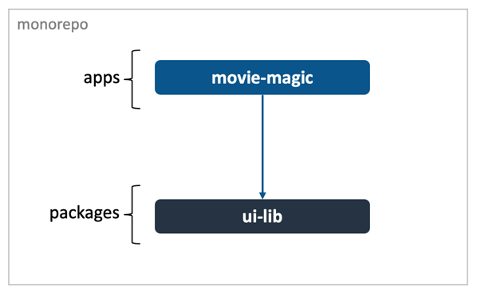

# Introduction

Code Shaper is an easy-to-use code generator that will save you time whenever
you start a new project and everytime you create a component, helper or another
artifact that follows a pattern.

The goal of this tutorial is to get you started with Code Shaper as quickly as
possible. It is divided into four parts:

1. [Setting up a monorepo](./setting-up-a-monorepo)
2. [Creating a component library](./creating-a-component-library.md)
3. [Creating an application](./creating-an-application.md)
4. [Writing your own custom generator](./writing-a-custom-generator)

## The Tutorial App

During the course of the tutorial, we will build a simple web app called _Movie
Magic_. It shows a list of top 10 movies and allows the user to watch any of
them.

## Implementation Plan

Here's our plan to implement this app:

1. Create a **monorepo** where we will build this app modularly. We will use
   [Turborepo](https://turborepo.org/) for this.
2. Create a workspace called **ui-lib** which will house reusable React
   components, such as buttons, tabs and menus.
3. Create another workspace called **movie-magic** where we will house the main
   application. This app will use components from the ui-lib.
4. Write a generator to replace `fetch` based hooks to `react-query` and
   `axios`.

By convention, we store apps under the **apps** folder and libraries under the
**packages** folder of the monorepo.

:::tip Notice the modular nature of Code Shaper

As we progress through the tutorial, you will notice that we use different
plugins for different aspects of the application. Code Shaper itself is
unopinionated about the technologies you use, however plugins usually are.
Choose from the many off-the-shelf plugins designed to work with specific
technologies or roll your own to fit your unique needs. We will look at the
second option in the last part of the tutorial.

:::

:::danger Pay attention

To get the most out of this tutorial, please follow the instructions
meticulously. A missed step could mean a lot of wasted of time and frustration.

:::

Let's get started. Navigate to [Setting up a monorepo](./setting-up-a-monorepo).
